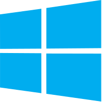
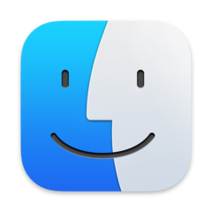

# windows95

This is Windows 95, running in an [Electron](https://electronjs.org/) app. Yes, it's the full thing. I'm sorry.

## Downloads

<table class="is-fullwidth">
</thead>
<tbody>
</tbody>
  <tr>
    <td>
      <br />
      Windows
    </td>
    <td>
      <span>32-bit</span>
      <a href="https://github.com/felixrieseberg/windows95/releases/download/v4.0.0/windows95-4.0.0-setup-ia32.exe">
        💿 Installer
      </a> |
      <a href="https://github.com/felixrieseberg/windows95/releases/download/v4.0.0/windows95-win32-ia32-4.0.0.zip">
        📦 Standalone Zip
      </a>
      <br />
      <span>64-bit</span>
      <a href="https://github.com/felixrieseberg/windows95/releases/download/v4.0.0/windows95-4.0.0-setup-x64.exe">
        💿 Installer
      </a> |
      <a href="https://github.com/felixrieseberg/windows95/releases/download/v4.0.0/windows95-win32-x64-4.0.0.zip">
        📦 Standalone Zip
      </a><br />
      <span>ARM64</span>
      <a href="https://github.com/felixrieseberg/windows95/releases/download/v4.0.0/windows95-4.0.0-setup-arm64.exe">
        💿 Installer
      </a> |
      <a href="https://github.com/felixrieseberg/windows95/releases/download/v4.0.0/windows95-win32-arm64-4.0.0.zip">
        📦 Standalone Zip
      </a><br />
      <span>
        ❓ Don't know what kind of chip you have? It's probably `x64`. To confirm, on your computer, hit Start, enter "processor" for info.
      </span>
    </td>
  </tr>
  <tr>
    <td>
      <br />
      macOS
    </td>
    <td>
      <span>Apple Silicon Processor</span>
      <a href="https://github.com/felixrieseberg/windows95/releases/download/v4.0.0/windows95-darwin-arm64-4.0.0.zip">
        📦 Standalone Zip
      </a><br />
      <span>Intel Processor</span>
      <a href="https://github.com/felixrieseberg/windows95/releases/download/v4.0.0/windows95-darwin-x64-4.0.0.zip">
        📦 Standalone Zip
      </a>
      <span>
        ❓ Don't know what kind of chip you have? If you bought your computer after 2020, select "Apple Silicon". Learn more at <a href="https://support.apple.com/en-us/HT211814">apple.com</a>.
      </span>
    </td>
  </tr>
  <tr>
    <td>
      <br />
      Linux
    </td>
    <td>
      <span>64-bit</span>
      <a href="https://github.com/felixrieseberg/windows95/releases/download/v4.0.0/windows95-4.0.0-1.x86_64.rpm">
        💿 rpm
      </a> |
      <a href="https://github.com/felixrieseberg/windows95/releases/download/v4.0.0/windows95_4.0.0_amd64.deb">
        💿 deb
      </a><br />
    </td>
  </tr>
</table>

<hr />

<table width="100%">
  <tr>
    <td width="50%">
      
    </td>
    <td width="50%">
      
    </td>
  </tr>
</table>

## Does it work?
Yes! Quite well, actually - on macOS, Windows, and Linux. Bear in mind that this is written entirely in JavaScript, so please adjust your expectations.

## Should this have been a native app?
Absolutely.

## Does it run Doom (or my other favorite game)?
You'll likely be better off with an actual virtualization app, but the short answer is yes. In fact, a few games are already preinstalled - and more can be found on the Internet, for instance at [archive.org](https://www.archive.org). [Thanks to
@DisplacedGamers](https://youtu.be/xDXqmdFxofM) I can recommend that you switch to a resolution of
640x480 @ 256 colors before starting DOS games - just like in the good ol' days.

## Credits

99% of the work was done over at [v86](https://github.com/copy/v86/) by Copy aka Fabian Hemmer and his contributors.

## Contributing

Before you can run this from source, you'll need the disk image. It's not part of the
repository, but you can grab it using the `Show Disk Image` button from the packaged
release, which does include the disk image. You can find that button in the
`Modify C: Drive` section.

Unpack the `images` folder into the `src` folder, creating this layout:

```
- /images/windows95.img
- /images/default-state.bin
- /assets/...
- /bios/...
- /docs/...
```

Once you've done so, run `npm install` and `npm start` to run your local build.

If you want to tinker with the image or make a new one, check out the [QEMU docs](./docs/qemu.md).

## Other Questions

 * [MS-DOS seems to brick the screen](./HELP.md#ms-dos-seems-to-brick-the-screen)
 * [Windows 95 is stuck in a bad state](./HELP.md#windows-95-is-stuck-in-a-bad-state)
 * [I want to install additional apps or games](./HELP.md#i-want-to-install-additional-apps-or-games)
 * [Running in Docker](./docs/docker-instructions.md)
 * [Running in an online VM with Kubernetes and Gitpod](./docs/docker-kubernetes-gitpod.md)

## License

This project is provided for educational purposes only. It is not affiliated with and has
not been approved by Microsoft.
